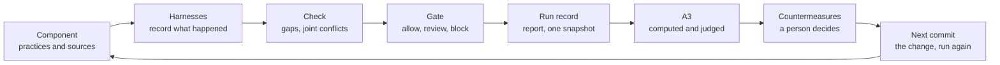
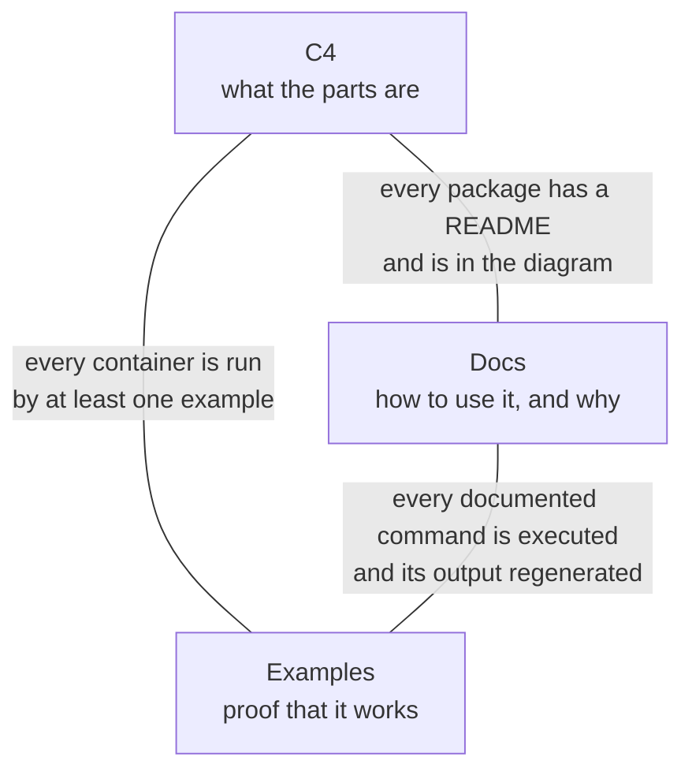

# CSH Anchor Component, Harnesses and A3: Design

Oct 3, 2026 · @Leigh · Design, read-only copy

> A read-only copy of the design document, taken on 3 October 2026 (Implementation brief, section 14.1). Like tabs 0 to 8 it is not edited in the repository. Where it and tabs 0 to 8 disagree, it governs for the sections listed in 6.5 and nowhere else. Its two figures are redrawn here as Mermaid diagrams.

The harness is built, but the lockout A3 was produced by code that lives inside one example. This design adds the missing product layer: a **component** to anchor on, **harnesses** that record evidence from it, a **run** that ties one evaluation to one snapshot, and an **A3** built from runs as the harness's response. It is a design; nothing here is implemented or compiled.

## 1. What is missing

Everything that turned the lockout example into an A3 lives under `examples/lockout`, and none of it can be pointed at another codebase. This was read from the repository `lgriffin/CSH` at commit `361115a`.

| Piece that produced the A3 | Where it lives | Lines | Why it cannot be reused |
|---|---|---|---|
| Scenario adapter | `examples/lockout/adapters/gherkin.ts` | 210 | The lockout step phrases are compiled in, and the cited source name is fixed to `Product` |
| A3 builder and styles | `examples/lockout/a3/build.ts`, `a3.css` | 470 | Columns are fixed to `ears`, `bdd`, `tdd`; it reads stage folders that a script made |
| Judgments | `examples/lockout/a3/a3.json` | 119 | Rules place a signal by a substring of its text, such as `AcceptCorrectPassword` |
| Orchestration | `examples/lockout/walkthrough.sh` | 190 | A shell script; stages are file overlays copied into a scratch repository |
| Test instrumentation | `examples/lockout/test/lockout.test.ts` | 38 | Each test builds its own pre-state, post-state and arguments and calls `recordWitness` by hand |
| Subject code | `examples/lockout/src/lockout.ts` | 20 | Written to carry the off-by-one; it is an illustration, not a component |

The product itself is thirteen packages and about 7,700 lines of source. It knows a specification, sources, a report and a gate decision. It has no notion of a component, a run or an A3: `csh/config.json` holds only `spec`, `mode`, `budgetMs`, `implementationPaths`, `specPaths`, `requirementIdPattern` and `adapters`.

Three further things surfaced while reading, each of which this design fixes:

- **A silent assumption in the witness helper.** `recordWitness` stamps every record `passed`, because a helper called mid-test cannot see the outcome (`packages/witness/src/record.ts`). Passed records are the ones lifted as claims. A test that records and then fails its assertion would therefore be lifted as a claim. That breaks P10.
- **Two changes the lockout A3 asked for are not built.** Countermeasures C7 (compare an example with another example) and C8 (let a witness cite a requirement) are named on the sheet. I found neither in the source.
- **Stages exist only as folders.** The four stages of the lockout run are directories the script copies reports into. Nothing in the product records that a report belongs to a snapshot of a component.

## 2. The anchor: a component

A component is one named unit of software under evaluation, declared in a manifest, and every run, report, gate decision and A3 is keyed to it.



*One loop: every run of a component can answer with an A3.*

Check and Gate exist in the product today. The other six boxes exist only inside the lockout example, or not at all. The loop is one turn of plan, do, check, act.

### 2.1 The manifest

`csh/component.json` replaces the `adapters` and `implementationPaths` settings of `csh/config.json`, which keeps the tool settings (`mode`, `budgetMs`). Its digest joins the snapshot, so changing what is evaluated changes the snapshot.

```ts
interface ComponentManifest {
  schema: "csh-component/v1";
  name: string;                    // "SignInService"; equals the system name in the specification
  spec: string;                    // the CSL module
  implementation: string[];        // paths whose change makes a witness stale
  practices: Practice[];
}

interface Practice {
  id: string;                      // "ears", "bdd", "tdd": a lane on the A3
  name: string;                    // "EARS"
  kind: "requirements" | "scenarios" | "tests" | "design-notes";
  sources: string[];               // names of s.source(...) in the specification that this practice feeds
  adapter?: string;                // package or project path; built-in by source kind when absent
  harness?: {                      // how to run the practice so that it records witnesses
    run: string[];                 // argument vector, never a shell string
    witnesses: string;             // the file the run writes
  };
  author?: string;                 // a role, shown on the A3: "Product owner"
  unit?: string;                   // what one artefact is: "the sentence", "the scenario", "the test"
}
```

Rules:

- A practice names sources that the specification already declares. A source no practice names is reported as `unowned-source`; a practice naming a source that does not exist is an error.
- One component per `csh/` directory. A repository with several components has several roots, each run with `--root`.
- The manifest holds no judgment and no authority. It says what is evaluated, never what is right.
- `csh init` writes a manifest by asking for each field. It guesses nothing from the repository layout (P10).

The lockout manifest would read:

```json
{
  "schema": "csh-component/v1",
  "name": "SignInService",
  "spec": "spec/lockout.csl.ts",
  "implementation": ["src"],
  "practices": [
    { "id": "ears", "name": "EARS", "kind": "requirements", "sources": ["Product"], "author": "Product owner", "unit": "the sentence" },
    { "id": "bdd", "name": "BDD", "kind": "scenarios", "sources": ["Scenarios"], "adapter": "@csh/adapter-gherkin", "author": "Three amigos", "unit": "the scenario" },
    { "id": "tdd", "name": "TDD", "kind": "tests", "sources": ["UnitTests"], "author": "Developer", "unit": "the test",
      "harness": { "run": ["node", "--test", "test/lockout.test.ts"], "witnesses": "reports/witnesses.ndjson" } }
  ]
}
```

## 3. Harnesses

A harness is the code that sits between a practice and the evaluator and records what the practice did, without asserting anything. Three are needed for the first real component; all code below is a proposed sketch and has not been compiled.

### 3.1 The probe: witnesses without hand-built records

Today each test assembles `pre`, `post` and `args` itself. A probe wraps the function under test once and records every call.

```ts
import { probe } from "@csh/harness";
import { signIn, type Login } from "../src/lockout.ts";

// Declared once per event. Each mapper says where a witness key comes from.
const signInProbe = probe("SignIn", signIn, {
  pre: (login: Login) => ({ ...login }),
  args: (_login, passwordOk: boolean) => ({ passwordOk }),
  post: (out) => ({ ...out.login }),
  result: (out) => out.result,
  mocked: [],
});

test("locks on the third failure", (t) => {
  const out = signInProbe.in(t, { cites: ["LCK-001"] })({ failedAttempts: 2, locked: false, lockSeconds: 0 }, false);
  assert.equal(out.login.locked, true);
});
```

- The probe calls the real function and returns its real result. It never changes behaviour.
- The mappers are the only place that names witness keys. They are reviewed like bindings, because they decide what the harness sees.
- `mocked` is stated by the author. The probe cannot detect a test double, so it does not claim to (P10).
- `cites` carries requirement identifiers onto the witness (section 6).

### 3.2 True outcomes

The probe does not know whether its test passed, so it writes no outcome. The test runner does.

1. The probe writes each witness with the test's identity and **no** `localResult`.
2. A reporter for the test runner writes one line per finished test to `reports/executions.ndjson`: test identity, and passed, failed or errored.
3. The witness adapter joins the two by test identity.

| Witness | Execution line | Result |
|---|---|---|
| Present | passed | Witness, and lifted as an example claim |
| Present | failed or errored | Witness only; never a claim |
| Present | missing | Witness with outcome unknown; never a claim; gap `outcome-unknown` |
| Missing | passed | Nothing; the test recorded no witness. Gap `unobserved-test` |

The last row gives a count the harness lacks today: tests that run and say nothing to it. Version 1 ships a reporter for Node's built-in test runner, which is what the repository uses. Other runners need their own reporter and are out of scope.

`recordWitness` stays for hand-written records, but its default of `passed` is removed. A record with no outcome is unknown.

### 3.3 Scenarios as a package

`@csh/adapter-gherkin` is the example's adapter with the lockout-specific parts moved into project files.

| Today, compiled into the example | In the package |
|---|---|
| The `STEPS` table of phrases | `csh/steps.ts` in the project, exporting the table; loaded in the adapter's sandbox |
| `CITED_SOURCE = "Product"` | The `cites` setting of the practice in the manifest |
| `UNITS` and `units.json` | Unchanged: conversions stay in the source, where a team records them as decisions |

Behaviour is unchanged. A scenario with an unknown step is kept whole as unliftable. A tag shaped like a requirement identifier becomes a citation. Scenarios are read, not executed; running them through a scenario runner to produce witnesses is a later harness.

### 3.4 What a harness may never do

- Assert, retry, or alter the result of the code under test.
- Fill in a value it did not observe.
- Decide that a practice passed. Exit codes and outcomes are stored as execution facts and never enter a verdict (P2).

## 4. Runs

A run is one evaluation of one component at one snapshot, produced by one command, and it replaces the shell script's hand-copied stage folders.

### 4.1 `csh run`

1. Load the manifest and compute the snapshot.
2. For each practice with a harness, execute its argument vector with `CSH_COMMIT`, `CSH_WITNESS_FILE` and `CSH_EXECUTIONS_FILE` set. Record the exit code.
3. Emit the specification, run the adapters, check, and gate. This is the existing pipeline, moved out of the command-line package.
4. Write the run record.

A harness command is the project's own test command. It runs with the project's normal permissions, exactly as running the tests by hand would. CSH does not sandbox it and says so in the run record.

```ts
interface Run {
  schema: "csh-run/v1";
  component: string;
  snapshot: Snapshot;                 // as today, plus componentDigest
  snapshotDigest: string;
  harnesses: { practice: string; argv: string[]; exitCode: number; witnesses: number; executions: number }[];
  reportDigest: string;
  gateDigest: string;
}
```

A run is stored under `.csh-cache/runs/<snapshotDigest>/` as `run.json`, `report.json` and `gate.json`. The cache is not committed. The same snapshot always gives the same directory, so a repeated run overwrites itself.

### 4.2 Stages are commits

The lockout example builds its four stages by copying overlay folders. In a real repository a stage is a commit: before, after the fix, after approval. Nothing else is needed to name one.

`csh run --at <commit>` evaluates a past commit in a temporary worktree, the mechanism the tool already uses to compute authorship. It needs that commit's dependencies to be installable. When they are not, the run fails and the stage is reported as unavailable; it is never filled from a neighbouring run.

### 4.3 Dirty trees

A run on uncommitted changes is allowed and marked `-dirty`, as today. It cannot become an A3 stage, because nobody could reproduce it.

## 5. The A3 response

An A3 is the harness's answer to one problem on one component: every number on it is counted from runs, and every judgment on it is written by a person and marked with its authority.

### 5.1 Two inputs, one model

| Input | Holds | Lives in |
|---|---|---|
| Stages | An ordered list of runs, each a commit of the component | `csh/a3/<slug>/stages/<id>/` |
| Judgments | What only a person can say, and the rules that place each signal on the sheet | `csh/a3/<slug>/judgments.json` |

The output is a model, `csh-a3/v1`, as JSON. Markdown and HTML are rendered from that model and nothing else, as the text report is rendered from the report JSON today.

### 5.2 What is computed and what is judged

| Section of the sheet | Computed from runs | Written by a person |
|---|---|---|
| Title and problem |  | Both |
| The run, stage by stage | Tests, signals, conflicts, rules satisfied, gate, per stage | Stage name and one line on what changed |
| 1 Background | The practice table's fixed columns, from the manifest | The prose; what each practice cannot say |
| 2 Current condition | Every signal; counts per lane; the Pareto; the "CSH reports" cell of each decision point | Decision points; what each practice says at each; the class |
| 3 Goal | Each measure at each stage, and whether its target is met | The goal sentence; targets where they differ from the defaults |
| 4 Root cause | Whether each evidence pointer resolves | The questions, the answers, the 5 Whys |
| 5 Countermeasures | Status: verified, not cleared, nothing to clear, proposed | What, kind, which question it answers, which signals it should clear |
| 6 Plan |  | Who and when |
| 7 Follow-up | The gate result at the last stage; any signal that returned |  |

A signal that no rule places is shown as unclassified. It is never dropped, so a new kind of finding appears on the sheet the first time it occurs.

### 5.3 Signals and matching

The example places signals by searching their text. The product gives a signal fields and matches on those.

```ts
interface Signal {
  id: string;                      // stable across runs: kind plus sorted members
  kind: string;                    // a finding kind, a gap kind, an error code, "not-comparable", "violated"
  fragments: string[];             // qualified names involved
  sources: string[];               // source names involved
  practices: string[];             // practice ids, through the manifest
  subject?: string;                // for gaps: the term, item or obligation
  detail?: string;
}

interface Match {
  kind: string;
  fragment?: string;               // exact qualified name, or its last segment
  source?: string;
  practice?: string;
  subject?: string;
  not?: Match;
}
```

`signalsOf(report, manifest)` moves from the example into the `check` package, so the A3 and any later consumer read one definition.

### 5.4 Judgments

```ts
interface Judgments {
  schema: "csh-a3-judgments/v1";
  title: string;
  problem: string;
  background: string[];
  stages: { id: string; name: string; what: string }[];
  cannotSay: Record<string, string>;                 // practice id -> text
  lanes: { id: string; practice: string | "hub"; step: number; title: string; where: string; match: Match[] }[];
  causes: { id: string; name: string; match: Match[] }[];
  decisionPoints: {
    point: string;
    class: "contradiction" | "drift" | "silence";
    says: Record<string, { mark: "says" | "clash" | "drift" | "silent"; text: string }>;   // by practice id
    note?: string;
    match: Match[];
  }[];
  goal: string;
  targets?: Record<string, string>;                  // measure id -> target
  rca: { id: string; q: string; a: string; evidence?: Pointer; depth: string }[];
  whys: { q: string; a: string; evidence?: Pointer; root?: string }[];
  countermeasures: { id: string; kind: string; what: string; answers: string[]; clears?: Match[]; expects?: Match[]; stage?: string }[];
  plan: { what: string; who: string; when: string }[];
}

type Pointer = { file: string; text: string } | { finding: string; stage: string };
```

The one structural change from the example is `says`: a decision point is keyed by practice id from the manifest, so a component with two practices or five gets the right columns.

### 5.5 Checks on the judgments

The builder reports these as problems on the sheet. It never repairs them.

| Problem | Condition |
|---|---|
| `unclassified` | A signal that no cause places |
| `dead-rule` | A match rule that places no signal at any stage |
| `dangling-pointer` | An evidence pointer whose file lacks the quoted text at the stage's commit, or whose finding id is absent from that stage |
| `unknown-practice` | A lane or decision point names a practice the manifest lacks |
| `unanswered` | A root-cause question that no countermeasure answers |
| `unverifiable` | A countermeasure with neither `clears` nor `stage`, and a kind other than scope or process |

### 5.6 Authority

An agent can write a persuasive root cause, so judgments are treated like any other fragment.

- The judgments file has a digest. Its fragment name is `#a3/<slug>`.
- It is candidate until an intent owner approves that digest through the ledger, by signed commit, as for an obligation.
- The sheet's header states the authority: candidate, approved, or approved (self-approved).
- Any edit to the judgments returns the sheet to candidate.
- An A3 never changes a verdict or a gate decision. It reads them.

### 5.7 Stage records

An A3 is a record of a problem and must still read correctly after its branches are gone. `csh a3 stage <slug> <id> --at <commit>` copies that commit's run record (`run.json`, `report.json`, `gate.json`) into `csh/a3/<slug>/stages/<id>/`, and those files are committed.

`csh a3 verify <slug>` re-runs each stage at its commit and compares digests. A stage that differs is reported as `stage-mismatch`; one that cannot be re-run is `stage-unverifiable`. Neither is hidden.

### 5.8 How it is wired

| Moment | What happens |
|---|---|
| `csh run` ends with a cross-source conflict, or the enforcing gate blocks | The output's last line names the run and the command `csh a3 open <slug>` |
| `csh a3 open <slug>` | Writes a judgments skeleton from the latest committed run: stage one is that run, lanes come from the manifest's practices, every signal is listed as unclassified, and every judged section is empty |
| `csh a3 stage <slug> <id> --at <commit>` | Adds a stage (5.7) |
| `csh a3 build <slug>` | Writes `a3.json`, `a3.md` and `a3.html` beside the judgments |
| `csh a3 build <slug> --check` | Fails when the committed output differs from the built one; this is what continuous integration runs |
| `csh a3 verify <slug>` | Recomputes the stages (5.7) |

An empty judged section renders as "not yet written", never as blank space, so a half-finished sheet cannot be mistaken for a finished one.

### 5.9 Measures

The seven measures of the lockout sheet become the defaults, each with an id so a target can be overridden: conflicts between claims; not comparable; shape mismatches and dangling citations; examples with no rule; silences without an owner decision; rules satisfied on approved evidence; enforcing gate allows. Section 12 adds an eighth: examples that cite a requirement. They stay separate rows and are never combined into a score.

## 6. Changes to the core

Four changes to the existing packages are needed, two of which the lockout A3 already named as countermeasures C7 and C8. Each amends the formal specification, so the owner approves the amendment before it is built.

### 6.1 Examples compared with examples (C7)

Today an example is compared only with rules. Two practices that contradict each other on the same input are seen only when a rule happens to sit between them.

New query, for two examples on the same event from different sources:

```latex
SAT(in_1 \land in_2) \qquad UNSAT(in_1 \land in_2 \land then_1 \land then_2)
```

`in` is an example's given state and arguments. The finding kind is `example-divergence`, and it records whether the inputs are `identical` (both state every field and argument, with equal values) or `overlapping` (they can coincide, but one leaves something unstated).

It is named a divergence and not a conflict for a reason. An example claims that a step exists. Two examples with the same input and different outcomes contradict each other only if the event always gives one outcome for one input, and the specification does not say that today. So the finding offers four readings and chooses none: one example is wrong; an unstated input separates them; the intent is undecided; or the event may answer the same input in more than one way.

A specification may state determinism by name: `s.event("SignIn", { ..., deterministic: true })`. That is an elevated assumption like any other. With it, a divergence on identical inputs is reported as an `example-conflict` between the two examples.

### 6.2 Witnesses that cite (C8)

A witness gains an optional `cites: string[]` of requirement identifiers. The practice's manifest entry says which source they refer to. The lifted example carries the citation, so:

- A cited sentence is no longer `uncited` merely because no predicate exists yet.
- A test citing an identifier that does not exist is a `dangling-citation`, as for scenarios.
- The A3's lanes can show which sentence each test claims to serve.

### 6.3 Outcomes

`localResult` becomes optional in the witness record, and the format becomes `csh-witness/v2`. Version 1 records are still read and keep the outcome they state. The join of section 3.2 supplies the outcome; without it the outcome is unknown.

### 6.4 Component in the snapshot and the report

- `Snapshot` gains `componentDigest`.
- `Report` gains `component` and, per source, the practice that owns it.
- New gap kinds: `unowned-source`, `outcome-unknown`, `unobserved-test`.
- `signalsOf` is exported from `check` (section 5.3).

### 6.5 Amendments to the specification

| Document | Section | Amendment |
|---|---|---|
| Semantic contract | 4, named queries | Add the example-divergence query |
| Semantic contract | 1, the model | Optional `deterministic` on an event |
| Joint evaluation | 4.1, finding kinds; 5, gaps | `example-divergence`; three gap kinds |
| Evidence and adapters | 2, witness format; 5, adapter A | Version 2; optional outcome; `cites`; the outcome join |
| Authority and ledger | 4, snapshots | `componentDigest` |
| Architecture | 2, containers | Three containers: harness, run, A3 |

## 7. Packages and commands

Five new packages carry the new layer, and the command-line package loses the pipeline it holds today.

| Package | Holds | Depends on | Trusted |
|---|---|---|---|
| `component` | Manifest types, loading, validation, digest | `kernel` | Yes |
| `harness` | The probe; the reporter for Node's test runner | `witness` | No |
| `adapter-gherkin` | The scenario adapter; loads the project's step table | `kernel`, `witness` | No |
| `run` | Harness execution, the pipeline, the run store, `--at` worktrees | `component`, `emit`, `check`, `ledger`, `gate` | Yes |
| `a3` | Stage loading, judgment checks, the A3 model, the Markdown and HTML renderers | `component`, `check` (types and signals), `kernel` | No |

"Trusted" keeps the meaning of the architecture tab: a defect there could produce a false satisfied or a false approval. `a3` cannot, because it only reads reports and decisions. `run` can, because it calls the gate.

`project.ts`, `pipeline.ts` and `sources.ts` move from `cli` to `run`. The `cli` package becomes argument parsing and printing.

### 7.1 Commands

| Command | Does |
|---|---|
| `csh init` | Writes `csh/component.json` from answers; guesses nothing |
| `csh run [--at <commit>]` | Harnesses, check and gate for one snapshot; stores the run |
| `csh a3 open <slug>` | Skeleton judgments from the latest committed run |
| `csh a3 stage <slug> <id> --at <commit>` | Adds a stage and its run record |
| `csh a3 build <slug> [--check]` | Builds the model and both renderings |
| `csh a3 verify <slug>` | Re-runs every stage and compares |

`csh check` and `csh gate` remain, for use without harnesses.

### 7.2 What moves out of the example

| Today | Becomes |
|---|---|
| `examples/lockout/adapters/gherkin.ts` | `packages/adapter-gherkin`; the step table stays in the example as `csh/steps.ts` |
| `signalsOf`, `matches` in `a3/build.ts` | `check`, with structured fields |
| `pareto`, measures, countermeasure status in `a3/build.ts` | `a3`, as pure functions over stages and judgments |
| The HTML, the Markdown and `a3.css` | `a3` renderers; the path-specific code highlighting is dropped |
| `a3/a3.json` | `examples/lockout/csh/a3/three-practices/judgments.json`, rules rewritten as structured matches |
| `walkthrough.sh` | Four commits, four `csh run` calls, `csh a3 build --check`; the expected counts move into a fixture |
| Hand-built witnesses in `test/lockout.test.ts` | One probe |
| `csh/config.json` `adapters`, `implementationPaths` | `csh/component.json` |

### 7.3 Documentation

Each new package gets a README to the existing template. The container diagram source gains the three containers, each new container gets a component diagram, and each decision in section 13 becomes a decision record once made. The two existing documentation tests cover the new packages without change.

## 8. The first real component

The anchor is the harness's own gate, decided on 3 October 2026: the disposition decision in `packages/gate/src/gate.ts`. It is real source that nobody wrote to make a point, and it keeps the project standalone.

Why it fits:

- **It is inside the language's reach.** The decision takes a verdict, an applicability, a mode, and four yes-or-no facts (a valid waiver exists, the policy is critical, the fragment is self-approved, it needs review) and returns a disposition. Those are enumerations and booleans, which the predicate subset covers. Waiver expiry involves dates and stays outside the model, entering as the yes-or-no fact.
- **Three descriptions of it already exist and were never read together.** The disposition table in the Authority tab, section 6; the sentences CSH-011 and CSH-013 and principle P9; and the unit tests in `packages/gate/test/gate.test.ts`.
- **It is ****140 lines that the safety of everything else rests on****.** A defect there turns a violation into an allow.
- **Its A3 is not known in advance.** The lockout sheet was designed and then produced. This one would be whatever the run finds.

What has to be written for it, all by the owner or as candidates for the owner:

| Practice | Exists | To write |
|---|---|---|
| Requirements | The table, two sentences and a principle | The table's seven rows as identified sentences in EARS form |
| Model | Nothing | One event, `Decide`, with a transition per row, in CSL |
| Tests | The unit tests | A probe around `gate`, mapping one assessment to the event's arguments |
| Scenarios | Nothing | Optional; a feature file of the rows the owner cares about most |

The lockout example stays. It becomes the teaching example and the regression fixture for the A3 package: rebuilt through the product path, every count on its sheet must equal the committed one.

The alternative considered was to grow the sign-in example into a fuller service with unlock and lock expiry. It reads better to a newcomer, but it remains code written in order to be evaluated.

## 9. Build order

Seven stages follow the nine already built, each closed by fixtures written before the code, as before.

| Stage | Build | Exit |
|---|---|---|
| 10 Component and run | `component`; `run` with the pipeline moved out of `cli`; `csh init`, `csh run`, `--at`; snapshot and report changes | The four lockout stages, as four commits run by `csh run`, give the finding and gap kinds the script's `expect` lines list today. F80: a practice naming a missing source is an error. F81: a source no practice names is `unowned-source` |
| 11 Harness | `harness` probe and reporter; witness version 2; the outcome join; `cites` | F82: a witness whose test failed is not lifted as a claim. F83: a witness with no execution line is outcome unknown. F84: a passing test with no witness is `unobserved-test`. F85: a cited identifier that does not exist is a dangling citation. The lockout tests on the probe record the same witnesses as today |
| 12 Scenario adapter | `adapter-gherkin`; the project step table | The lockout scenarios through the package give the same claim set as the example adapter. F86: an unknown step is unliftable |
| 13 Divergence | The example-divergence query; `deterministic`; `signalsOf` in `check` | F87: two examples from different sources diverge with no rule between them. F88: overlapping inputs are marked overlapping. F89: with `deterministic`, identical inputs give an example conflict. F90: examples from one source are not compared |
| 14 A3 | `a3`; the four `csh a3` commands | The lockout sheet through the product path: every count equal to the committed sheet, apart from the changes stages 11 and 13 introduce (section 12). F91: an unplaced signal is shown as unclassified. F92: a dead rule. F93: a dangling pointer. F94: a tampered stage report fails `verify`. F95: edited judgments return to candidate |
| 15 Anchor | The gate component: manifest, model, sentences, probe; its first A3 | `csh run` completes on the gate component, and `csh a3 open` produces a skeleton with every signal listed. What it finds is not specified in advance |
| 16 Start point | Compiled, installable packages; examples/starter; the root README rewritten around the three doors and the ladder; the two new triangle checks | F96: the starter, copied to an empty directory outside the repository and installed from packed tarballs, completes csh run. Every command block in the root README is executed in continuous integration. A container with no example fails the build |

Stages 10 to 12 change no verdict logic. Stage 13 is the only one that touches the solver. Stage 15 is the first evaluation whose answer nobody chose. Stage 16 comes last because the starter needs the probe and the run command. Every stage's exit also includes the three corners of section 11.

## 10. The start point

You read it right: someone who finds the repository today can watch the harness work on its own examples, and cannot use it on their own code.

| A visitor wants to | Today |
|---|---|
| See what it does | Works: clone, `pnpm install`, run `examples/lockout/walkthrough.sh`, read the A3 |
| Install it in their own repository | Not possible: all thirteen packages are marked private and none is published |
| Start on their own code | No `init`. The only documented entries are the two example scripts, which copy an example into a scratch folder inside the clone so that it can resolve the `csl` package |
| Know what to write first | Nothing says. Both examples arrive complete, with specification, bindings, tests and requirements already written |

So "no anchorage" holds twice. The examples are not anchored to a component (sections 2 and 8), and a visitor is not anchored to a first step.

### 10.1 Three doors

The root README opens with three doors, chosen by what the visitor wants.

| Door | The visitor's question | Leads to |
|---|---|---|
| See it | What does this do? | The lockout A3, then its walkthrough |
| Use it | Can I run it on my code? | The starter (10.3) and the ladder (10.2) |
| Understand it | How is it built, and why? | Context diagram, container diagram, package README, decision record, in that order |

### 10.2 The ladder

Each rung is one thing the visitor adds and one result they get back. No rung requires the next, so a team can stop where the value stops.

| Rung | You add | You get back |
|---|---|---|
| 1 Inventory | `csh init`: a manifest naming your practices and where their files are | Every requirement sentence as an identified item, each listed as uncited; your tests counted as unobserved |
| 2 Vocabulary and a probe | The state and one event in CSL; a probe around one function; bindings | Your passing tests as examples in one vocabulary, each with no rule behind it |
| 3 First rule | One requirement predicate that cites one sentence | The first place where a test can disagree with a sentence |
| 4 Second practice | Scenarios with a step table, or tests that cite | Conflicts and divergences across practices |
| 5 Model | A transition for the event | Rules checked by the solver, so that they can become satisfied |
| 6 Authority | A maintainers file, signed approvals, the enforcing gate in continuous integration | A change that breaks an approved rule is blocked even when its tests are green |
| 7 A3 | Judgments on a problem a run found | The sheet |

Rung 1 asks for a specification that holds only a system name and its sources. Whether emission accepts a system with no vocabulary is unverified.

### 10.3 The starter

`examples/starter` is the smallest component at rung 3: one function, one probe, one sentence, one rule. Unlike the two existing examples it stands alone. Copied to an empty directory outside the repository, it installs and runs, and a fixture tests exactly that. The "Use it" door says: copy this, then replace the function with yours.

### 10.4 Installable

- Local only, decided 3 October 2026: nothing is published to npm. Every package keeps its private flag, so nothing can be published by accident.
- A user installs from the clone: tarballs made by `pnpm pack`, or a path dependency. The starter's fixture installs from tarballs.
- Package exports point at TypeScript source today. As far as I know Node will not strip types from files under `node_modules`, so a packed package needs compiled JavaScript. This is unverified, as is whether `pnpm pack` accepts a private package.

## 11. The iron triangle

C4, docs and examples are the three proofs of intent, and each is tested against the other two so that none can drift alone.



*Each corner is tested against the other two.*

A change to the code that leaves any corner behind fails one of the three checks on the sides.

### 11.1 What binds each side

| Side | Check | Exists today |
|---|---|---|
| C4 and docs | Every package has a README and appears in the container diagram source; every decision record a README cites exists | Yes: two tests in `testkit` |
| Docs and examples | Every command a document shows is executed, the document is regenerated from the real output, and continuous integration fails on a difference | For the two walkthroughs and the lockout A3. Not for the root README |
| Examples and C4 | Every container is exercised by at least one example | No |

Two checks are new. The root README's command blocks are executed like the walkthroughs. Each example's README declares the containers it exercises; a test compares that with the commands the example runs and fails when a container has no example.

### 11.2 What each new piece owes

| Piece | C4 | Docs | Example |
|---|---|---|---|
| `component` | In the container diagram; its own component diagram | README; manifest reference | The starter's and the lockout's manifests |
| `harness` | Container and component diagram | README; a guide to writing a probe | The starter's probe; the lockout tests on the probe |
| `adapter-gherkin` | In the adapters component diagram | README; a guide to the step table | The lockout step table |
| `run` | Container and component diagram; the run sequence | README; `csh run` in every walkthrough | All examples run by `csh run` |
| `a3` | Container and component diagram | README; a guide to writing judgments | The lockout sheet; the gate's first sheet |
| Divergence query | The check engine's component diagram | The amendment and its decision record | The lockout's third-attempt divergence |
| Start point | The context diagram, unchanged | The root README and the ladder | The starter |

### 11.3 The rule

A stage is done when all three corners moved in the same change as the code. The stage note lists what moved at each corner. The implementer's brief already requires documentation in the same commit; this adds the example.

## 12. C7 and C8, end to end

The two harness countermeasures the lockout A3 proposed are built in this plan and then verified on the sheet that proposed them.

|  | C7: compare example with example | C8: let a witness cite a requirement |
|---|---|---|
| The A3 says | "Add an example-to-example query: two examples from different sources whose inputs can coincide and whose outcomes cannot both hold." | "Let a witness cite a requirement, so a unit test carries the same link a scenario tag does." |
| Root-cause questions it answers | Q6 | Q2 and Q6 |
| Design | Section 6.1 | Sections 3.1 and 6.2 |
| Stage | 13 | 11 |
| Fixtures | F87 to F90 | F85 |
| Proof on the lockout | The scenario and the test on the third attempt diverge at the first stage with no rule needed between them | The lockout tests cite their sentences from the countermeasures stage onward |
| How the sheet verifies it | The countermeasure names the signal it expects to appear; status is verified when it does | A new default measure, examples that cite a requirement, meets its target of all |

Two small additions to section 5 follow from this.

- A countermeasure gains `expects`, the mirror of `clears`: signals that must appear once it is in place. C7 makes a contradiction visible, so nothing it does can be shown by a signal going away.
- The default measures become eight, with "examples that cite a requirement".

Both change the lockout sheet. Its committed counts will move at stages 11 and 13, and each stage note records which counts moved and why.

## 13. Decisions and limits

Three decisions are made. The other three are taken as named assumptions so that the build is not blocked; the owner can reverse each, and the last column of 14.2 says what a reversal costs.

- **The anchor.** The gate's disposition decision. Decided 3 October 2026.
- **Authority of A3 judgments.** Approved through the ledger like an obligation. Decided 3 October 2026.
- **Distribution.** Local only; no npm yet. Decided 3 October 2026.
- **Stage records.** Assumed: committed under `csh/a3/` so the sheet survives its branches. The other option keeps them only in the cache.
- **Divergence and determinism.** Assumed: a divergence with four readings unless the event is declared deterministic. The other option treats every event as deterministic.
- **Scenarios.** Assumed: read only, as today. The other option also executes them so that they produce witnesses.

Not verified, and to be confirmed before building on it:

- Whether a reporter for Node's test runner can give a test identity that the probe can also see from inside the test, so the two files join. If not, the probe must be handed the identity explicitly.
- Whether CSL accepts an event on a state with no fields. The gate decision is stateless; if a state is required, the model needs a placeholder, and that is an assumption to name.
- Whether `csh run --at` is practical where a past commit's dependencies differ from the current ones.
- Whether the quantifier-free divergence query stays inside the solver budget when a component has hundreds of witnesses. The number of pairs grows with the square of the examples per event.

Limits that remain after this design:

- An A3's judged sections are only as good as the person writing them. The tool checks that they point at real evidence and that their rules place real signals. It cannot check that a root cause is the right one.
- A probe sees what its mappers show it. State the function touches and the mappers omit is invisible, and nothing reports it.
- One test runner and one scenario notation are covered. Everything else still arrives as claim sets or stays unliftable.

## 14. Implementation brief

This section is the instruction to whoever builds stages 10 to 16. It adds to the existing brief in `docs/spec/06-implementers-brief.md`, whose twelve working rules still apply unchanged.

### 14.1 Before any code

1. Copy this document into the repository as `docs/spec/09-anchor-harness-a3.md`, read-only like the other eight. Where it and tabs 0 to 8 disagree, it governs for the sections listed in 6.5 and nowhere else.
2. Write one decision record for each made decision in section 13, and register the three assumptions of 14.2 in `ASSUMPTIONS.md`.
3. Settle the unverified points below and record each answer in `DEPENDENCIES.md` or `QUESTIONS.md`. An answer that breaks the design goes to `QUESTIONS.md`, with the most conservative option taken, as rule 2 of the existing brief says.
4. Write the fixture directories F80 to F96, each with its README and expected result taken from this document, before the code they test.

To verify first:

- A reporter for Node's test runner and the probe can agree on a test's identity (section 3.2).
- CSL accepts an event on a state with no fields, for the stateless gate decision (section 8).
- Emission accepts a system with no vocabulary, for rung 1 (section 10.2).
- `pnpm pack` works on a private package, and what a packed package must contain to run from `node_modules` (section 10.4).
- `csh run --at` works when a past commit's dependencies differ from the current ones (section 4.2).
- The divergence query stays inside the solver budget as examples per event grow (section 6.1).

### 14.2 Assumptions in force

| Name | Assumed | Affects | Cost of reversal |
|---|---|---|---|
| A3-stage-records | Stage records are committed under `csh/a3/` | Section 5.7; stage 14 | Small: drop the copy step; `build` reads the cache and reports a missing stage as unavailable |
| Divergence-not-conflict | Example against example is a divergence unless the event is declared deterministic | Section 6.1; stage 13 | Small: the `deterministic` flag becomes the default; F88 and F89 change |
| Scenarios-read-only | Scenarios are read and never executed | Section 3.3; stage 12 | Larger: a scenario runner harness is a new package and a new stage |

### 14.3 Order

The stages are built in number order, 10 to 16, one pull request each. No stage begins until the previous stage's exit fixtures pass. There is no pause for review between stages; each ends with its stage note.

| Stage | Needs | Changes verdict logic |
|---|---|---|
| 10 Component and run | The nine built stages | No |
| 11 Harness | 10 | No; changes which records become claims |
| 12 Scenario adapter | 10 | No |
| 13 Divergence | 11 | Yes: one new query and finding kind |
| 14 A3 | 10, 13 | No |
| 15 Anchor | 11, 14 | No |
| 16 Start point | 11 | No |

### 14.4 Rules added to the twelve

1. **The triangle moves with the code.** Each stage's change includes its C4 sources, its documents and its example, as section 11.2 lists. The stage note names what moved at each corner.
2. **Nothing that passes today may fail.** The 51 existing fixtures and both walkthroughs stay green at every stage. When a committed count on the lockout sheet moves, the stage note says which count and why.
3. **Old records stay readable.** Version 1 witness files are still read, with the outcome they state.
4. **Nothing is published.** Every package keeps its private flag.
5. **The gate's sheet is the owner's.** For the anchor, write the manifest, the model, the sentences and the probe as candidates, run it, and open the skeleton. Leave every judged section of its A3 empty. Do not approve anything, and do not explain what the run found beyond the report.
6. **A finding against the gate is a result, not a failure of the stage.** If the run shows the table, the sentences, the tests and the code disagreeing, record it and stop there. Do not change `gate.ts` to make it go away.

### 14.5 Done means

- F80 to F96 pass, with the 51 earlier fixtures.
- The lockout example runs through `csh run` and `csh a3 build --check`, with no shell script deciding anything.
- The gate component has a completed run and an opened A3 skeleton, committed.
- The starter installs and runs from an empty directory outside the repository.
- The three triangle checks pass, including the two new ones.
- Each of the five new packages has a README, a place in the container diagram and a component diagram.
- `QUESTIONS.md` and `ASSUMPTIONS.md` are current, and seven stage notes exist.

### 14.6 First instruction

> Read `docs/spec/09-anchor-harness-a3.md` in full, then the existing implementer's brief. Do section 14.1 first: verify the six points, write the decision records, register the assumptions, and write fixtures F80 to F96 before any code. Then build stages 10 to 16 in order, one pull request each, without pausing for review. Follow the eighteen rules. Keep every existing fixture and both walkthroughs green. For the gate component, stop at the opened A3 skeleton and leave its judged sections empty. Finish with a summary of which fixtures pass, which do not and why, what moved on the lockout sheet, and what the first run of the gate component reported.
